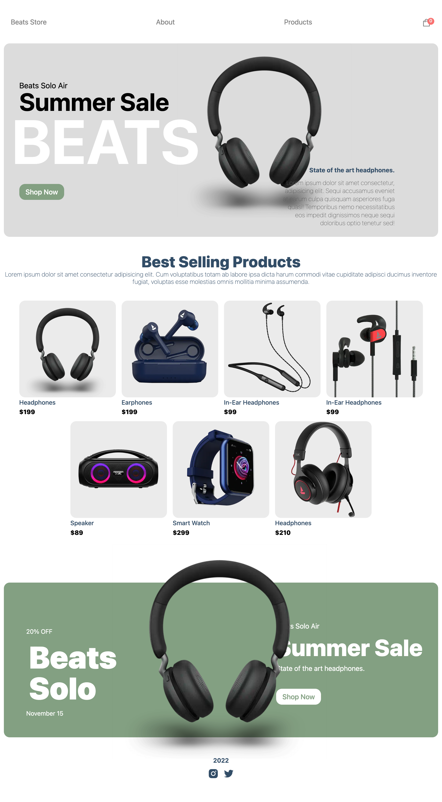

<div id="top"></div>

<div align="center">


[![Contributors][contributors-shield]][contributors-url]
[![Forks][forks-shield]][forks-url]
[![Stargazers][stars-shield]][stars-url]
[![Issues][issues-shield]][issues-url]

<!-- [![MIT License][license-shield]][license-url] -->

[![LinkedIn][linkedin-shield]][linkedin-url]

---

<a align="center" href="https://github.com/magdalenaperry/tech-deals-ecommerce">
    
</a>

# Tech-Deals

</div>

## Table of Contents

1. [Description](#description)
1. [Technologies](#technologies)
1. [Prerequisites](#prerequisites)
1. [Installation](#installation)
1. [Usage](#usage)
1. [Visuals](#visuals)
1. [Contributors](#contributors)
1. [Roadmap](#roadmap)
1. [Contact](#contact)
1. [Acknowledgements](#acknowledgements)

---

## Description

Tech Deals, is an ecommerce application created with Sanity.io, Stripe functionality, on a React, NextJs framework.

#### Deployed Links:

[Tech Deals Repository Link ](https://github.com/magdalenaperry/tech-deals-ecommerce)

[Tech Deals Link ](https://tech-deals-ecommerce.vercel.app/)

<p align="right">(<a href="#top">back to top</a>)</p>

---

## Technologies

- JavaScript
- React
- NextJs
- Sanity.io
- Stripe
- bootstrap
- react-icons
- react-hot-toast

<p align="right">(<a href="#top">back to top</a>)</p>

---

## Prerequisites

1. Node.js
   - [Node.js download](https://nodejs.org/en/)
2. verify installation

```
    node -v
    npm -v
```

<p align="right">(<a href="#top">back to top</a>)</p>

---

## Installation

```
  npm install
  npm run dev
  cd tech-store
  npm install
```

<p align="right">(<a href="#top">back to top</a>)</p>

---

## Usage

### .env

    NEXT_PUBLIC_SANITY_TOKEN =

    NEXT_PUBLIC_STRIPE_PUBLISHABLE_KEY =

    NEXT_PUBLIC_STRIPE_SECRET_KEY =

<p align="right">(<a href="#top">back to top</a>)</p>

---

## Visuals

<div align="center">

### 

<p align="right">(<a href="#top">back to top</a>)</p>

---

</div>

## Contributors

Magdalena Perry:

- [Linkedin](https://www.linkedin.com/in/magdalena-perry/)

- [Github](https://github.com/magdalenaperry)

<p align="right">(<a href="#top">back to top</a>)</p>

---

## Roadmap

- [x] Create ReactJs file structure
- [x] Link Sanity
- [x] Create Sanity DB
- [x] Link Stripe API
- [x] Styling & JavaScript

<p align="right">(<a href="#top">back to top</a>)</p>

---

## Contact

For any additional questions, please reach out to me through email and follow me on GitHub.

Name - [Magdalena Perry LinkedIn](https:www.linkedin.com/in/magdalenaperry)

Github - [magdalenaperry](https://www.github.com/magdalenaperry)

email - [mageltron@gmail.com](mageltron@gmail.com)

<p align="right">(<a href="#top">back to top</a>)</p>

---

## Acknowledgements

- [@react-icons](https://react-icons.github.io/react-icons/)
- [JS-Mastery](https://www.jsmastery.pro/)

<p align="right">(<a href="#top">back to top</a>)</p>

<!-- shield variables -->

[contributors-shield]: https://img.shields.io/github/contributors/magdalenaperry/tech-deals-ecommerce.svg?style=for-the-badge
[contributors-url]: https://github.com/magdalenaperry/tech-deals-ecommerce/graphs/contributors
[forks-shield]: https://img.shields.io/github/forks/magdalenaperry/tech-deals-ecommerce.svg?style=for-the-badge
[forks-url]: https://github.com/magdalenaperry/tech-deals-ecommerce/network/members
[stars-shield]: https://img.shields.io/github/stars/magdalenaperry/tech-deals-ecommerce.svg?style=for-the-badge
[stars-url]: https://github.com/magdalenaperry/tech-deals-ecommerce/stargazers
[issues-shield]: https://img.shields.io/github/issues/magdalenaperry/tech-deals-ecommerce.svg?style=for-the-badge
[issues-url]: https://github.com/magdalenaperry/tech-deals-ecommerce/issues
[license-shield]: https://img.shields.io/github/license/magdalenaperry/tech-deals-ecommerce.svg?style=for-the-badge
[license-url]: https://github.com/magdalenaperry/tech-deals-ecommerce/blob/master/LICENSE.txt
[linkedin-shield]: https://img.shields.io/badge/-LinkedIn-black.svg?style=for-the-badge&logo=linkedin&colorB=555
[linkedin-url]: https://linkedin.com/in/magdalena-perry
